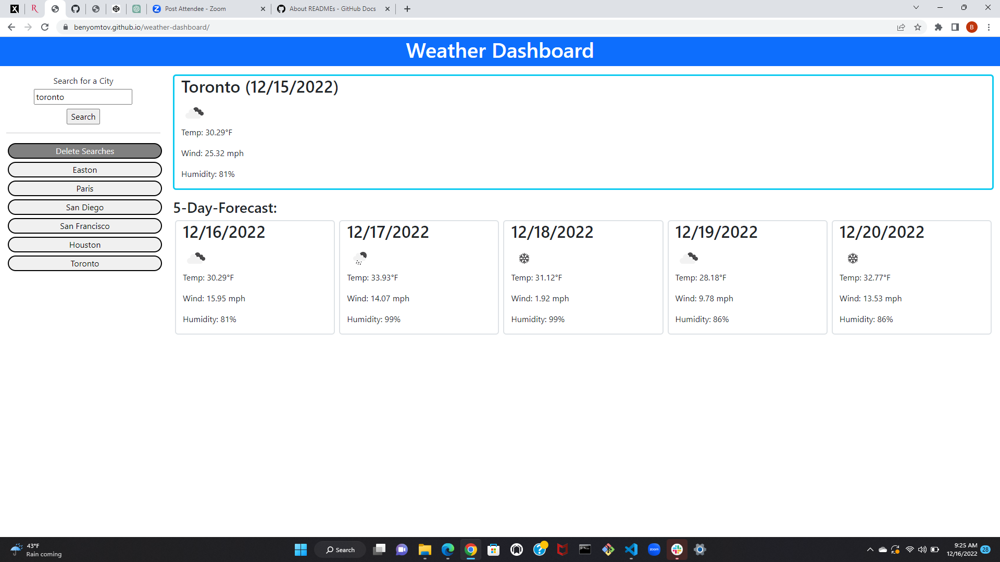

# Weather Dashboard

## Description

Provide a short description explaining the what, why, and how of your project. Use the following questions as a guide:

This application is a weather dashboard that shows the current weather and 5-day forecast based on city name. After searching a city's weather, that city is saved as a previous search and is accessible to search by clicking on a button with the name of the previous search. This weather dashboard was designed to help users easily access weather information for multiple cities in order to plan their schedules accordingly.

## Installation

This application requires no installation and can be accessed via browser at https://benyomtov.github.io/weather-dashboard/.

## Usage

Upon entering the webpage, the user will see a form to search for a city, a delete search button, as well as containers to hold weather information. To search a city, the user can simply type the city name into the search bar and click the "Search" button. After clicking the button, the weather data for that city will display, and a button with the city's name will be created underneath the delete searches button. After this, the user can either search a different city or click one of the saved city buttons to display that city's weather. If the user refreshes the page, all saved data will persist unless deleted.

## Credits

Created by Ben Yomtov

APIs used:

OpenWeatherMap https://openweathermap.org/api

Day.JS https://day.js.org/

## License

No license.